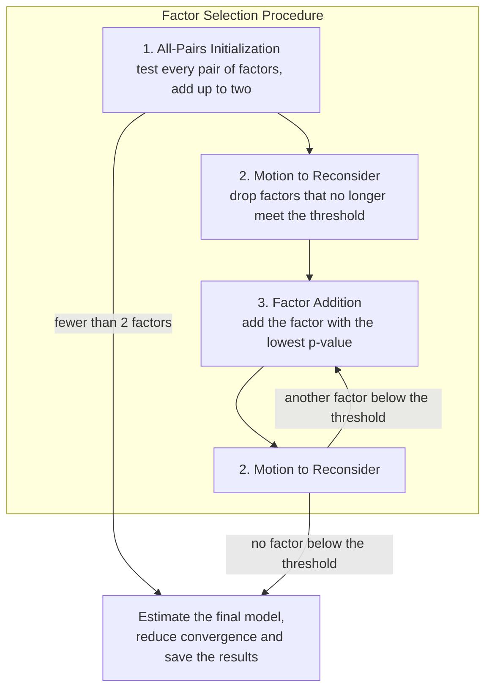

# Factor Selection Procedure

An automated model-building procedure for longitudinal brain networks. Given a person's structural (DTI) or functional (fMRI) brain network at two time points, it finds which network formation factors (RSiena effects such as transitive closure, betweenness or distance between regions) explain how the network changed between them.

The procedure runs on the real data and on two simulated datasets built from models with known factors. Because the right answer is known for the simulated datasets, they show how reliably the procedure recovers the factors that generated a network.

## The Factor Selection Procedure

Models are stochastic actor-oriented models fitted with [RSiena](https://www.stats.ox.ac.uk/~snijders/siena/). Every factor is added or dropped by a score test, with a threshold of p < 0.1 (set in `config.R`).



1. **All-Pairs Initialization.** For every pair of candidate factors, one is put in the model and the other is score-tested. The factor with the lowest average p-value is added first. The factor with the lowest p-value alongside it is added second. If fewer than two factors are below the threshold, the procedure ends here.
2. **Motion to Reconsider.** Every time a factor is added, every factor in the model is re-tested with the others kept in. Any factor that no longer meets the threshold is dropped.
3. **Factor Addition.** Every factor not yet in the model is score-tested against the current model. The one with the lowest p-value is added if it is below the threshold, followed by a Motion to Reconsider. This repeats until no factor qualifies.

After the procedure, the chosen model is estimated again until it converges well, and its factors, weights and standard errors are saved.

Before the procedure, the code estimates the model with every candidate factor switched on. This step is needed by the code, not by the method: it provides the RSiena effects object that every score test switches factors on and off in, and its estimates are not used. If this estimation fails, a real data window is skipped and a simulated dataset draws a new model.

## The datasets

| Dataset | Script | Networks | Question it answers |
|---|---|---|---|
| Real data | `real_data.R` | Each participant's real networks at two time points | Which factors drive this person's network change? |
| Simulated: individual model set | `individual_model_set.R` | Each instance draws its own model; time point 1 is a random real network and time point 2 is simulated from it | Does the procedure recover a model's factors? |
| Simulated: group model set | `group_model_set.R` | A few models, each producing many time point 2s from many different real time point 1s | How consistently does the procedure recover the same model? |

Each dataset can use fMRI, DTI or both combined (TYPE1), and the whole brain or one of seven functional systems (TYPE3). Combined runs model fMRI and DTI together, starting from the factors found for each on its own. For the real data, that means from the fMRI and DTI real data results. In the group model set, TYPEA 1 (fMRI) and TYPEA 2 (DTI) runs come first, followed by TYPEA 3 (both).

## Repository layout

```
real_data.R                     entry point: the real data
individual_model_set.R          entry point: simulated datasets, individual model set
group_model_set.R               entry point: simulated datasets, group model set
config.R                        every setting: paths, candidate factors, RSiena and procedure settings

setup/                          shared start of every job
datasets/                       how each dataset gets its time point 1 and 2 networks
factor_selection_procedure/
  run_factor_selection_procedure.R   runs the steps below in order
  0_preparation/                     networks and the effects object the score tests work in
  1_all_pairs_initialization/        score all pairs, first and second factor, Motion to Reconsider
  2_motion_to_reconsider.R
  3_factor_addition/                 score the remaining factors, add the best one, Motion to Reconsider
after_factor_selection/         final model, convergence reduction, results
R/                              supporting functions (estimation, simulation, loading, checkpoints)
cluster/                        Slurm scripts
```

The log marks each step, for example `==== All-Pairs Initialization > Second factor ====`.

## Running it

```
Rscript real_data.R            JOBID N TYPE1 TYPE3 COPY
Rscript individual_model_set.R JOBID N RATE TYPE1 TYPE3 COPY
Rscript group_model_set.R      JOBID N RATE TYPE1 TYPE3 TYPEA COPY
```

| Argument | Values | Meaning |
|---|---|---|
| `JOBID` | Slurm job ID | The job works in `<scratch_dir>/<JOBID>` |
| `N` | 1, 2, … | Instance: the N-th scan window (real data) or N-th simulated window |
| `RATE` | 5, 20, 35, 50, 65 | Base rate of the simulated networks |
| `TYPE1` | 1, 2, 3 | Modality: fMRI, DTI, combined |
| `TYPE3` | 1–8 | 1 = whole brain (100 regions); 2–8 = Vis, SomMot, DorsAttn, SalVentAttn, Limbic, Cont, Default |
| `TYPEA` | 0–3 | Combined group model set only: 1 = fMRI, 2 = DTI, 3 = both. Otherwise 0 |
| `COPY` | 1, 2, … | Repeat number (see below) |

### On a Slurm cluster

Each dataset has its own submission loop. Run from the repository root:

```bash
bash cluster/submit_real_data.sh 1-349 1            # scan windows 1-349, copy 1
```
```bash
bash cluster/submit_individual_model_set.sh 1       # instances 1-200 for every rate, copy 1
```
```bash
bash cluster/submit_group_model_set.sh 1            # instances 1-357 for every rate, copy 1
```

Put `DRY_RUN=1` in front to print the `sbatch` commands without submitting. Some runs need others to have finished first; each script's comments say which.

### Checkpoints, pausing and copies

Jobs save their full state as they go: after choosing the networks (`…Data0.RData`), after the all-factors estimate (`…Data1.RData`), and after every step of the Factor Selection Procedure (`…_copy<COPY>Data2.RData`). A job that gets close to the time limit saves and stops. Submitting it again with the same arguments continues where it left off.

A new COPY number starts the Factor Selection Procedure again from the same networks and all-factors estimate, without overwriting earlier copies. Combined runs use the fMRI and DTI results with the same COPY.

## Configuration

Everything that can be tuned is in [`config.R`](config.R):

- **Paths:** where the input data is, where results go, and the scratch folder.
- **Candidate factors:** for whole-brain, functional-system and combined models.
- **RSiena settings:** for estimation, the Factor Selection Procedure and convergence reduction.
- **Factor Selection Procedure settings:** threshold, repeats and attempts, and the job time limit.
- **Simulated datasets:** base rates, number of models, and how models are weighted towards fewer factors.

## Input data (not included)

This repository contains no imaging data or results. By default the procedure reads from the home directory (`data_dir` in `config.R`):

| Path | Contents |
|---|---|
| `fMRIOriginal/`, `DTIOriginal/` | One folder per participant with `Window*.mat` files. Each holds `Network1`, `Network2` (100 × 100 adjacency matrices), `Age1`, `Age2` and `ID.subject` |
| `FunctionalSystems.txt` | Region number and its functional system (1–7), tab separated |
| `DistanceMatrix.csv` | 100 × 100 distances between regions |
| `factorweights.mat` | Candidate weights for each factor, used to draw simulated models |

## Output

Results go to `<results_dir>/<fMRI|DTI|Combined><RealData|IndividualModelSet|GroupModelSet>Results/`, as one `.mat` file per instance and copy. Each file contains:

- the two networks and their densities (combined runs add `t1DTI`, `t2DTI`);
- the factors found (`determinedfactors`), with their weights, standard errors, rates and convergence;
- for simulated datasets, the model that generated the networks (`goalfactors`, `goalweights`, `goalrate`, and `modelnumber` for the group model set).

A `Completed/` folder records every finished run.

## Requirements

- R 4.4
- R packages: `RSiena`, `R.matlab`, `R.utils`, `parallel`, `foreach`, `doParallel`
